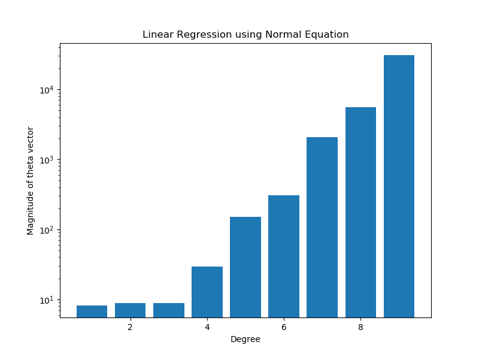

# ES654-2020 Assignment 3

*Chandan Maji* - *17110037*

------

> Write the answers for the subjective questions here

As we increase degree the magnitude of theta value increases, as we can see from the plot. This is because when we increase the decree the model tries to fit the training data more precisely, so in turn it forms complex functions involving higher degree polynomials. Therefore the theta values corrosponding of the polynomial features becomes more than 0, thus increasing the magnitude of the theta value.

