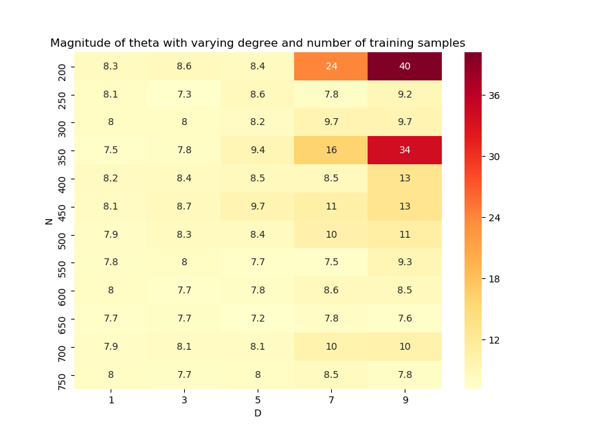

# ES654-2020 Assignment 3

*Chandan Maji* - *17110037*

------

> Write the answers for the subjective questions here

For a certain N, as we increase the degree, the magnitude of theta increases. The reason is already given in q5.

 

For a certain degree, as we increase the number of samples(N), the magnitude of theta decreases.

